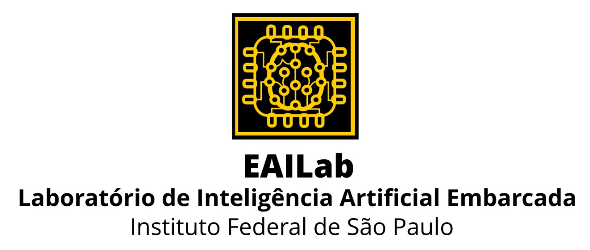

 

# Sistemas Especialistas erwtyuiopo

Material referente à disciplina de pós-graduação **Sistemas Especialistas Aplicado à Engenharia (P2SEA)**, criado pelo [Dr. Arnaldo de Carvalho Junior](https://www.linkedin.com/in/arnaldocarvalho/), com o auxílio do graduando em Engenharia [Bruno da Silva Alves](https://www.linkedin.com/in/bruno-alves-839813237).

  

## **Aula 01**

[1 - Introdução À Sistemas Especialistas](https://github.com/EAILAB-IFSP/Expert_Systems/blob/Expert_Systems/1%20-%20Introdu%C3%A7%C3%A3o%20%C3%80%20Sistemas%20Especialistas.pdf)

## **Aula 02**

[2 - Ruído - Perturbação - Incerteza - Contradição](https://github.com/EAILAB-IFSP/Expert_Systems/blob/Expert_Systems/2%20-%20Ru%C3%ADdo%20-%20Perturba%C3%A7%C3%A3o%20-%20Incerteza%20-%20Contradi%C3%A7%C3%A3o.pdf)

[Exercícios Matlab - Aula 02](https://drive.google.com/drive/folders/1f-4AUXFaqsKX4IAoLDa7-AArVn-BCIrt)

## **Aula 03**

[3 - Estimador e Filtro Kalman](https://github.com/EAILAB-IFSP/Expert_Systems/blob/Expert_Systems/3%20-%20Estimador%20e%20Filtro%20Kalman.pdf)

[Exercícios Matlab - Aula 03](https://drive.google.com/drive/folders/1OqLc7a4HdaIuAamFVAuKSKc73s6dPIQm)

## **Aula 04**

[4 - Introdução à Lógicas Alternativas](https://github.com/EAILAB-IFSP/Expert_Systems/blob/Expert_Systems/4%20-%20Introdu%C3%A7%C3%A3o%20%C3%A0%20L%C3%B3gicas%20Alternativas.pdf)

## **Aula 05**

[5 - Lógica Paraconsistente](https://github.com/EAILAB-IFSP/Expert_Systems/blob/Expert_Systems/5%20-%20L%C3%B3gica%20Paraconsistente.pdf)

[Exercícios Matlab - Aula 05](https://drive.google.com/drive/folders/15IEVtECJ-Ai3ohF2UFw3oPEwklUZISzA)

[Para Saber Mais sobre PAL2v](https://sites.google.com/view/prof-arnaldo/pal2v-key-points)

## **Aula 06**

[6 - Lógica Fuzzy](https://github.com/EAILAB-IFSP/Expert_Systems/blob/Expert_Systems/6%20-%20L%C3%B3gica%20Fuzzy.pdf)

[Exercícios Matlab - Aula 06](https://drive.google.com/drive/folders/19NGCoFHjQPDanZNk-FSrMKlDuxAnTN5x)

[Controle Fuzzy Sprinkle de Irrigação](https://github.com/EAILAB-IFSP/Expert_Systems/blob/Expert_Systems/Controle%20Fuzzy%20Sprinkle%20de%20Irriga%C3%A7%C3%A3o.pdf)

[Controle Fuzzy em Matlab](https://github.com/EAILAB-IFSP/Expert_Systems/blob/Expert_Systems/Controle%20Fuzzy%20em%20Matlab.pdf)

[Controle Temperatura Fuzzy](https://github.com/EAILAB-IFSP/Expert_Systems/blob/Expert_Systems/Controle%20Temperatura%20Fuzzy.pdf)

[Simples Controle Fuzzy P+I em Matlab](https://github.com/EAILAB-IFSP/Expert_Systems/blob/Expert_Systems/Simples%20Controle%20Fuzzy%20P%2BI%20em%20Matlab.pdf)

## **Aula 07**

[7 - Introdução à Redes Neurais Artificiais](https://github.com/EAILAB-IFSP/Expert_Systems/blob/Expert_Systems/7%20-%20Introdu%C3%A7%C3%A3o%20%C3%A0%20Redes%20Neurais%20Artificiais.pdf)

[7.1.CNNs](https://github.com/EAILAB-IFSP/Expert_Systems/blob/Expert_Systems/7.1.CNNs.pdf)

[Exercícios Matlab - Aula 07](https://drive.google.com/drive/folders/1tYynwI_ZHj-epUkL3ALc0LJ6t_Pb85MH)

[Exercícios Scilab - Aula 07](https://drive.google.com/drive/folders/1qYHy08w_S_A8kqT5Mkrwya8ITSBPYvTj)
